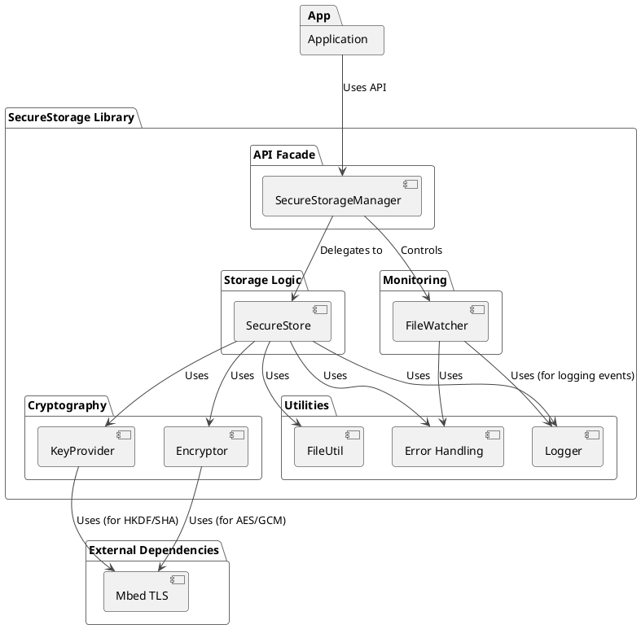

# SecureStorage Library: System Requirements & Project Proposal

**Document Version:** 1.0
**Date:** May 25, 2025
**Prepared For:** Project Stakeholders & Development Team
**Prepared By:** [Rajesh Kanakamedala](https://rajesh.venkatasudha.com)

## 1. Executive Summary

This document outlines the system requirements, project proposal, and implementation strategies for the **SecureStorage Library**. The primary goal of this project is to develop a robust, secure, and efficient C++11 compatible library for encrypting, decrypting, and managing sensitive data files. The library is specifically targeted for resource-constrained embedded environments, including automotive custom Linux hardware and Android 18 based displays, which typically have limited memory, CPU processing power, and no internet connectivity.

The SecureStorage library will provide functionalities for strong authenticated encryption (AES-256-GCM), device-specific key derivation using HKDF from a unique device serial number, atomic file operations for data resilience against power cycles, a backup and restore mechanism, and a file watcher service to monitor and log unintended modifications to stored data. The project emphasizes adherence to automotive coding standards, best software development practices, and thorough unit testing.

## 2. Introduction

### 2.1. Purpose
The purpose of the SecureStorage library is to offer a secure and reliable method for applications running on embedded devices to store and retrieve sensitive information persistently. This is particularly critical for features requiring time-bound activations or storing configuration data that must be protected from unauthorized access and tampering, especially in offline environments.

### 2.2. Scope
The scope of this project includes:
* Design and implementation of encryption and decryption services.
* Implementation of a secure key derivation mechanism.
* Development of a file storage system with atomic write and backup capabilities.
* Implementation of a file watcher service for Linux-based systems.
* Creation of a comprehensive unit testing suite.
* Development of a CMake-based build system.
* Provision of an example application demonstrating library usage.
* Generation of API documentation (Doxygen) and a project README.

**Out of Scope:**
* Hardware-specific secure element (HSM/TPM) integration (though the design could be extended).
* Network communication or cloud synchronization features.
* User interface components.
* Formal MISRA C++ compliance certification (though principles will be followed).

### 2.3. Goals
* Provide strong confidentiality and integrity for stored data.
* Ensure data resilience against unexpected power loss.
* Operate efficiently on low-resource embedded systems.
* Be easily integrable into C++11 applications.
* Provide a mechanism to detect and log unauthorized file modifications.
* Maintain high code quality and thorough test coverage.

## 3. System Requirements

### 3.1. Functional Requirements
| ID   | Requirement                                                                                                | Priority |
|------|------------------------------------------------------------------------------------------------------------|----------|
| FR01 | The library MUST provide a mechanism to encrypt arbitrary binary data.                                       | High     |
| FR02 | The library MUST provide a mechanism to decrypt data previously encrypted by it.                             | High     |
| FR03 | Encryption keys MUST be derived at runtime from a device-unique serial number (minimum 9 digits).            | High     |
| FR04 | Derived encryption keys MUST NOT be stored persistently on the device.                                       | High     |
| FR05 | The library MUST store encrypted data items, each identified by a unique string ID, as individual files.     | High     |
| FR06 | The library MUST support atomic write operations for data files to prevent corruption during power cycles.   | High     |
| FR07 | The library MUST implement a backup strategy for stored data files to allow recovery from corruption.        | High     |
| FR08 | The library MUST attempt to restore data from a backup if the primary data file is corrupted or missing.     | High     |
| FR09 | The library MUST provide a mechanism to delete stored data items (including their backups).                  | Medium   |
| FR10 | The library MUST provide a mechanism to check if a specific data item exists.                                | Medium   |
| FR11 | The library MUST provide a mechanism to list all existing data item IDs.                                     | Medium   |
| FR12 | The library MUST include a file watcher service (for Linux) to monitor specified files/directories.          | High     |
| FR13 | The file watcher MUST log detected operations (e.g., modify, delete, create, attribute change) on monitored items. | High     |
| FR14 | The file watcher MUST log events indicating potential tampering or unintended writes.                          | High     |
| FR15 | The library MUST provide a clear API for initialization, data storage, retrieval, and deletion.              | High     |
| FR16 | The library MUST provide clear error codes for all fallible operations.                                      | High     |

### 3.2. Non-Functional Requirements
| ID    | Category        | Requirement                                                                                             | Priority |
|-------|-----------------|---------------------------------------------------------------------------------------------------------|----------|
| NFR01 | Security        | Encryption MUST use AES-256-GCM for authenticated encryption.                                             | High     |
| NFR02 | Security        | Key derivation MUST use a cryptographically strong KDF like HKDF (RFC 5869).                              | High     |
| NFR03 | Security        | Encrypted files MUST be resistant to trivial inspection (not human-readable).                             | High     |
| NFR04 | Performance     | The library MUST have a low CPU and memory footprint suitable for embedded automotive/Android systems.    | High     |
| NFR05 | Performance     | Encryption/decryption performance SHOULD be comparable to other widely used open-source crypto libraries. | Medium   |
| NFR06 | Reliability     | The library MUST be resilient to power key cycles, ensuring data integrity.                               | High     |
| NFR07 | Reliability     | The library MUST be robust against common file system errors.                                             | High     |
| NFR08 | Reliability     | The library MUST be free of memory leaks.                                                                 | High     |
| NFR09 | Portability     | The library MUST be C++11 compatible.                                                                   | High     |
| NFR10 | Portability     | The library MUST be cross-compilable for target automotive custom Linux and Android 18 NDK.             | High     |
| NFR11 | Usability       | The library API MUST be clear, well-documented, and easy to integrate.                                  | High     |
| NFR12 | Maintainability | The codebase MUST follow automotive coding best practices and be well-commented.                        | High     |
| NFR13 | Maintainability | The library MUST be organized into logical, modular components.                                           | High     |
| NFR14 | Testability     | All core components MUST be unit-testable with high code coverage.                                      | High     |

### 3.3. Constraints
| ID   | Constraint                                                                    |
|------|-------------------------------------------------------------------------------|
| C01  | The library MUST be implemented in C++11.                                     |
| C02  | The library MUST operate without requiring internet access.                     |
| C03  | The library will use Mbed TLS as its underlying cryptographic provider.         |
| C04  | The file watcher implementation will initially target Linux using `inotify`.    |
| C05  | Device serial number (minimum 9 digits) will be provided at initialization.   |
| C06  | Root folder for encrypted file storage will be provided at initialization.      |

## 4. Proposed Solution & Architecture

### 4.1. High-Level Architecture
The SecureStorage library will be structured modularly to promote separation of concerns, testability, and maintainability. The key modules are:

1.  **SecureStorageManager (Facade Layer):**
    * The primary public interface for the library.
    * Coordinates the `SecureStore` and `FileWatcher` components.
    * Handles initialization and shutdown of the library services.

2.  **SecureStore (Storage Logic Layer):**
    * Manages the logical storage of data items.
    * Orchestrates encryption/decryption via the `Encryptor`.
    * Handles file I/O operations (read, atomic write, delete) via `FileUtil`.
    * Implements the backup and restore strategy for data files.

3.  **FileWatcher (Monitoring Layer):**
    * Monitors the specified storage directory for file system events using `inotify`.
    * Runs in a dedicated thread.
    * Logs detected events and can invoke a user-defined callback.

4.  **Crypto (Cryptography Layer):**
    * **KeyProvider:** Derives encryption keys using HKDF from the device serial number.
    * **Encryptor:** Performs AES-256-GCM encryption and decryption using Mbed TLS.

5.  **Utils (Utility Layer):**
    * **Logger:** Provides thread-safe logging capabilities.
    * **Error:** Defines custom error codes (`Errc`) and an `std::error_category`.
    * **FileUtil:** Provides file system helper functions (atomic write, read, delete, path manipulation, directory creation).

### 4.2. Component Diagram (Conceptual)
[SVG Representation](https://tinyurl.com/securestoragecomponentdiagram)

## 5. Implementation Details & Strategies

### 5.1. Cryptography
* **Algorithm:** AES-256-GCM (Galois/Counter Mode) will be used for authenticated encryption. This provides:
    * **Confidentiality:** 256-bit AES encryption.
    * **Integrity & Authenticity:** A 128-bit (16-byte) GMAC tag is generated during encryption and verified during decryption, protecting against data tampering.
* **Key Derivation (KeyProvider):**
    * An HKDF (HMAC-based Key Derivation Function, RFC 5869) with SHA-256 as the underlying hash function will be used.
    * **Input Keying Material (IKM):** The device's unique 9-digit (or longer) serial number.
    * **Salt:** A fixed, application-specific salt string (e.g., `"SecureStorageAppSalt-V1"`) compiled into the library or configurable. The salt does not need to be secret but should be unique per application context if multiple applications use the library with potentially overlapping serial numbers.
    * **Info/Context:** An application-specific info string (e.g., `"SecureStorage-AES-256-GCM-Key-V1"`) to ensure key separation if HKDF is used for other purposes.
    * **Output Key Length:** 32 bytes (256 bits) for AES-256.
* **Key Management:**
    * The master encryption key will be derived on-the-fly by the `KeyProvider` each time it's needed (e.g., during `SecureStore` initialization).
    * The key will **not** be stored persistently on the disk. This enhances security as there's no key file to be compromised. The security relies on the secrecy/immutability of the device serial number.
* **Initialization Vector (IV):**
    * A unique 12-byte (96-bit) IV will be randomly generated by the `Encryptor` for each encryption operation.
    * The IV will be prepended to the ciphertext.
* **External Library:** Mbed TLS will be used for AES, GCM, SHA-256, and HKDF primitives. It will be integrated into the CMake build system using `FetchContent` for ease of dependency management.

### 5.2. Data Storage (`SecureStore` & `FileUtil`)
* **File Format:** Each stored data item will result in an encrypted file with the following structure:
    `[ 12-byte IV | Encrypted Data | 16-byte GCM Authentication Tag ]`
* **File Naming:**
    * Main data files: `<data_id>.enc`
    * Backup files: `<data_id>.enc.bak`
    * Temporary files during atomic write: `<final_path>._atomicwrite_tmp` (internal to `FileUtil`)
* **Atomic Writes (`FileUtil::atomicWriteFile`):**
    1.  The directory for the final output file will be created if it doesn't exist.
    2.  Data is first written to a unique temporary file (e.g., `filepath + ".tmp"`) in the same directory as the final target using POSIX file operations.
    3.  The temporary file's data is explicitly synchronized to the physical storage using `fsync()` on its file descriptor.
    4.  The temporary file is closed.
    5.  The temporary file is then atomically renamed to the final target filename using `std::rename()`. This overwrites any existing file at the target path.
    6.  The parent directory of the final file is then explicitly synchronized using `fsync()` on its file descriptor to ensure the rename operation (directory entry update) is persistent. This step is crucial for preventing data loss if a power failure occurs immediately after the `rename`.
* **Backup and Restore Strategy (`SecureStore::storeData`, `SecureStore::retrieveData`):**
    * **Storing Data:**
        1.  New data is encrypted.
        2.  The encrypted data is written to a temporary file using `FileUtil::atomicWriteFile` (which itself uses an internal temporary file, e.g., `data_id.enc.tmp._atomicwrite_tmp`, then renames it to `data_id.enc.tmp`).
        3.  If the main file (`data_id.enc`) exists, any existing backup file (`data_id.enc.bak`) is deleted.
        4.  The existing main file (`data_id.enc`) is renamed to become the new backup file (`data_id.enc.bak`).
        5.  The temporary file (`data_id.enc.tmp`) containing the new encrypted data is renamed to become the new main file (`data_id.enc`).
    * **Retrieving Data:**
        1.  Attempt to read and decrypt the main file (`data_id.enc`).
        2.  If successful, data is returned.
        3.  If reading or decryption of the main file fails:
            a.  Log the error.
            b.  Attempt to read and decrypt the backup file (`data_id.enc.bak`).
            c.  If successful:
                i.  Return the decrypted data.
                ii. Attempt to restore the (encrypted) backup data to the main file location using `FileUtil::atomicWriteFile` to heal the main file.
            d.  If backup also fails, return an appropriate error (e.g., `DataNotFound` or the decryption error).
* **Data Model:** The library will store and retrieve `std::vector<unsigned char>`, allowing applications to serialize their own data structures (e.g., feature name and expiry date) into this byte vector format.

### 5.3. File Watcher (`FileWatcher`)
* **Mechanism:** Utilizes Linux's `inotify` API for efficient, kernel-level file system event monitoring.
* **Monitored Events:** Configured to watch for:
    * `IN_MODIFY`: File content modified.
    * `IN_CLOSE_WRITE`: File closed after being opened for writing (strong indicator of completed write).
    * `IN_ATTRIB`: File attributes (metadata) changed.
    * `IN_CREATE`: File/directory created within a watched directory.
    * `IN_DELETE`: File/directory deleted from a watched directory.
    * `IN_MOVED_FROM` / `IN_MOVED_TO`: File/directory moved into/out of a watched directory.
    * `IN_DELETE_SELF` / `IN_MOVE_SELF`: The watched item itself was deleted or moved.
* **Operation:**
    * Runs in a dedicated `std::thread`.
    * Uses `poll()` to wait for events on the `inotify` file descriptor and a separate pipe file descriptor. The pipe is used to signal the thread to terminate gracefully.
    * Initializes `inotify` with `IN_NONBLOCK` to facilitate clean shutdown.
* **Logging:** All detected and processed events will be logged with severity `INFO` using the library's `Logger`, including the path, filename (if applicable), and a string representation of the event mask.
* **Callback:** Supports an optional `std::function` callback that can be provided by the application to react to `WatchedEvent`s.
* **Scope:** The `SecureStorageManager` will instantiate and manage the `FileWatcher`, typically configured to watch the `rootStoragePath`.

### 5.4. Error Handling
* Errors will be reported using `SecureStorage::Error::Errc` enum values.
* A custom `std::error_category` (`SecureStorageErrorCategory`) will be provided to allow integration with `std::error_code` and provide meaningful error messages.
* Functions will return `Errc::Success` (value 0) on success.
* Exceptions will generally not be used for flow control in the core library functions, adhering to embedded and automotive best practices.

### 5.5. Logging
* A simple, thread-safe `Logger` class will be implemented (currently using `std::cout`).
* Supports different log levels (DEBUG, INFO, WARNING, ERROR).
* Log messages will include timestamp, log level, source file, and line number.
* The default log level will be `DEBUG` for non-release builds and `WARNING` for release (`NDEBUG`) builds, configurable via `Logger::setLogLevel()`.

### 5.6. Build System
* **CMake (version 3.14+):** Will be used as the build system generator.
* **C++ Standard:** Strictly C++11.
* **Dependencies:**
    * Mbed TLS: Integrated via `FetchContent`. Configured to build as a static library, with its example programs and tests disabled.
    * Google Test: Integrated via `FetchContent` for unit testing.
* **Structure:** Modular, with subdirectories for `utils`, `crypto`, `storage`, `file_watcher`, `examples`, and `tests`.

### 5.7. Cross-Compilation
* The use of standard C++11, CMake, and Mbed TLS (which is portable) facilitates cross-compilation.
* For Android NDK, a CMake toolchain file will be required.
* For custom automotive Linux, a suitable cross-compiler toolchain will be used with CMake.
* `inotify` is Linux-specific, aligning with the target platforms.

### 5.8. Memory Management
* **RAII:** Resource Acquisition Is Initialization will be strictly followed. `std::unique_ptr` will be used for managing dynamically allocated memory (e.g., PImpl objects, `SecureStore`, `FileWatcher` instances within `SecureStorageManagerImpl`).
* **Dynamic Allocation:** Minimized in performance-critical or frequently called paths. `std::vector` and `std::string` are used, which manage their own memory; care will be taken with `reserve()` where appropriate to reduce reallocations.
* **No Manual `delete`:** Explicit `delete` will be avoided by relying on smart pointers and standard library container destructors.

### 5.9. Coding Standards
* Adherence to general C++ best practices for safety, reliability, and maintainability.
* Principles aligned with MISRA C++ (e.g., strong typing, explicit initializations, clear control flow, limited use of problematic features) will be followed, though formal MISRA compliance checking is out of scope unless a tool is provided.
* Code will be well-commented, particularly public APIs (Doxygen) and complex logic.

## 6. Testing Strategy
* **Unit Testing Framework:** Google Test (GTest), integrated via `FetchContent`.
* **Coverage:** Aim for high statement and branch coverage for all core logic.
* **Test Structure:** Tests will be organized by module (e.g., `test_ss_utils`, `test_ss_crypto`, `test_ss_storage`, `test_ss_file_watcher`, `test_ss_manager`).
* **File System Tests:** Tests for `FileUtil`, `SecureStore`, and `FileWatcher` that interact with the file system will use a dedicated temporary directory created and cleaned up per test case or fixture to ensure isolation and repeatability.
* **Asynchronous Testing:** `FileWatcher` tests will use `std::condition_variable` and callbacks to manage and verify asynchronous event detection.
* **Test Execution:** `ctest` will be used to run the test suite.

## 7. Deliverables
1.  Complete C++11 source code for the SecureStorage library.
2.  CMake build system scripts.
3.  Comprehensive unit test suite using Google Test.
4.  Doxygen-generated API documentation (HTML).
5.  A project `README.md` file.
6.  An example application demonstrating library usage (command-line encryptor/decryptor utility and potentially a `SecureStorageManager` usage example).
7.  This System Requirements and Project Proposal document.

## 8. Assumptions and Dependencies
* **Assumptions:**
    * A unique device serial number (minimum 9 digits) is available to the application and can be provided to the library.
    * The target systems provide a POSIX-compliant environment for file system operations and `inotify`.
    * The application has necessary permissions to read/write/create files and directories in the specified root storage path.
* **Dependencies:**
    * C++11 compliant compiler.
    * CMake (3.14+).
    * Mbed TLS (library will fetch if not found).
    * Google Test (for building and running tests, library will fetch).
    * Standard C and C++ libraries.
    * (For File Watcher) Linux kernel with `inotify` support.

## 9. Project Plan / Development Phases (Conceptual)
The project has conceptually followed these phases:
1.  **Phase 0: Requirements Gathering & Initial Design:** Defining scope, features, and core architecture. (Completed)
2.  **Phase 1: Core Utilities & Cryptographic Primitives:**
    * Implementation of Logger, Error handling, basic FileUtil. (Completed)
    * Implementation of KeyProvider (HKDF) and Encryptor (AES-GCM) using Mbed TLS. (Completed)
    * Unit tests for these components. (Completed)
3.  **Phase 2: Secure Storage Logic:**
    * Implementation of `FileUtil` enhancements (atomic writes, directory creation). (Completed)
    * Implementation of `SecureStore` (data management, backup/restore). (Completed)
    * Unit tests for `FileUtil` and `SecureStore`. (Completed)
4.  **Phase 3: Main Library API:**
    * Implementation of `SecureStorageManager` facade. (Completed)
5.  **Phase 4: File Watcher:**
    * Implementation of `FileWatcher` using `inotify`. (Completed)
    * Unit tests for `FileWatcher`. (Completed)
6.  **Phase 5: Integration & Manager Testing:**
    * Integration of `FileWatcher` into `SecureStorageManager`. (Completed)
    * Unit tests for `SecureStorageManager` including watcher integration. (Completed)
7.  **Phase 6: Example Application & Documentation:**
    * Development of example application(s). (Completed)
    * Generation of Doxygen comments and README.md. (Current Phase)
8.  **Phase 7: Final Review & Refinement:**
    * Review against automotive standards and best practices. (Current Phase)
    * Performance profiling and optimization if necessary (Future consideration).
    * Final testing on target hardware (Future consideration by integrating team).

## 10. Risks and Mitigation (High-Level)
* **Risk:** Platform-specific behavior of `inotify` or file system operations.
    * **Mitigation:** Focus on POSIX standards; thorough testing on target platforms is crucial.
* **Risk:** Security vulnerabilities in Mbed TLS or custom crypto logic.
    * **Mitigation:** Use well-vetted library (Mbed TLS); keep Mbed TLS updated; follow cryptographic best practices; conduct security reviews if possible.
* **Risk:** Performance issues on highly constrained devices.
    * **Mitigation:** Design for low footprint; profile on target hardware; optimize critical paths if necessary.
* **Risk:** Complexity of asynchronous testing for `FileWatcher`.
    * **Mitigation:** Use robust synchronization primitives in tests; allow for timing variations. (Addressed)
* **Risk:** Ensuring true atomicity and data integrity across all power-fail scenarios.
    * **Mitigation:** Careful implementation of atomic write and backup logic; extensive testing of these scenarios. The atomic write logic now includes fsync on both the data file and its parent directory to enhance data integrity.

This document provides a comprehensive overview of the SecureStorage library project. It should serve as a foundational reference for its development, features, and intended use.